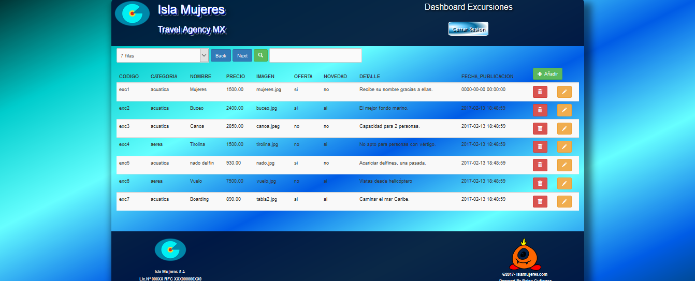

# TRAVEL-AGENCY-MX

Descripción de la aplicación

Esta aplicación está orientada a dar soporte a la administración de la agencia de viajes, gestionando, a través de un crud las excursiones que ofrece como producto propio. Al mismo tiempo ofrece a los usuarios que visitan la web, la oportunidad de ver e informarse a cerca de la belleza del Caribe Mexicano.
La aplicación es responsive, para móviles y tablets.

AMBITO USER-WEB
El usuario puede navegar por el sitio sin necesidad de registrarse.      
 

 
 

 
Algunas pestañas son,
 

 
 

 
 

 
El carrito de la compra,
 

 
 
AMBITO ADMIN
Aquí sí que debe loguearse el administrador, 
 

 
Y accede al listado de excursiones,
 

 
